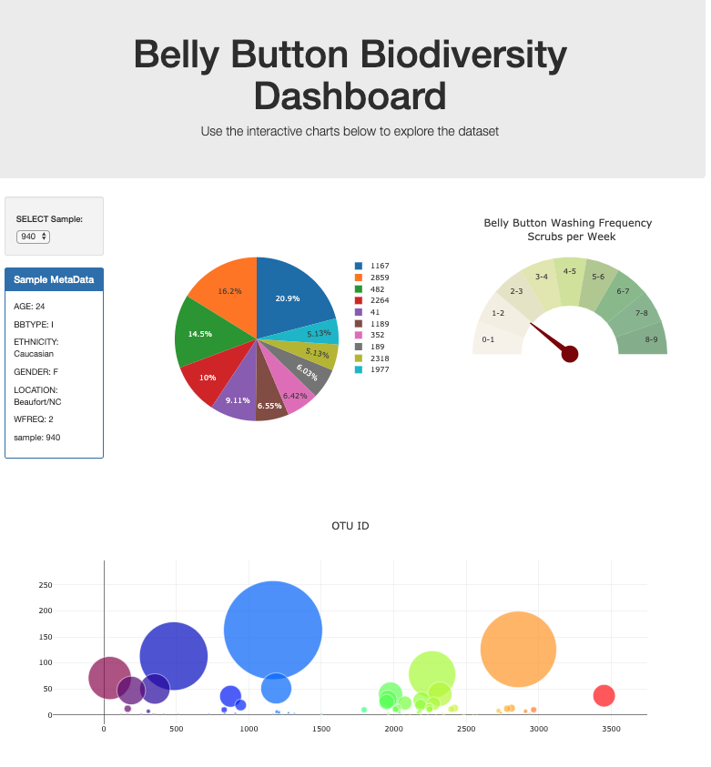

#  Belly Button Biodiversity Dashboard Analysis
## Data Visualization Dashboard
The Belly Button Analysis dashboard is available for preview at https://cryptic-inlet-32193.herokuapp.com
_________________

Belly Button Biodiveristy Analysis used an interactive dashboard to explore the  [Belly Button Biodiversity DataSet](http://robdunnlab.com/projects/belly-button-biodiversity/).

## Plotly.js
This project used JavaScript, Plotly.js, Python, HTML, CSS, Bootstrap, and Flask to explore the Belly Button Biodiverisity dataset. The data was analyzed and then I built three graphs using Plotly and Javascript. The pie chart shows the top ten samples for a particular sample id. The bubble chart shows all the samples and OTU ID data points. Metadata for the sample is also displayed, along with a gauge chart for wahing freequency. The display for each key/value pair from the metadata JSON object on the page. The graphs resize when the page size is modified. 
## Code Files:
* app.py- the Flask app that calls the Python functions to read and store the bio samples, OTU and metagata.

* index.html- Contains the Javascript code to get the data and create the 3 chars, the metadata, and the dropdown with the list of sample IDs.

* style.css- CSS styling for the panel 

## Heroku:
Lastly, the FLASK app was deployed to Heroku to dipslay the interactive dashboard

  

- - -

